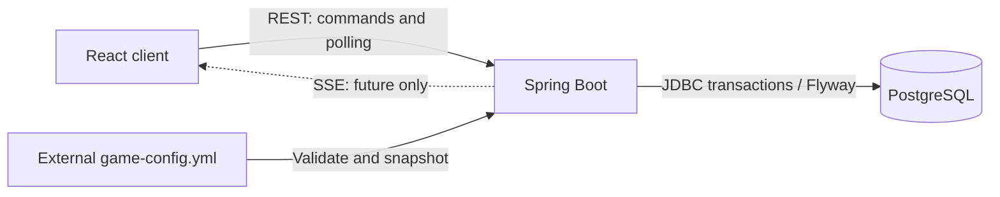
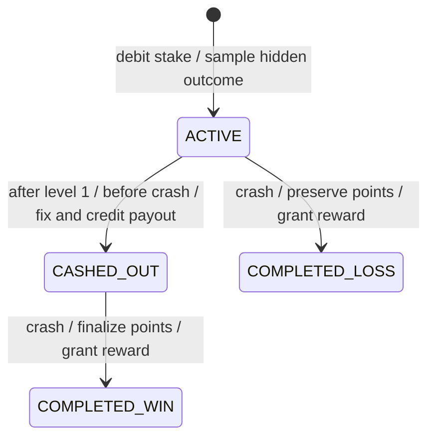

# SkyRush architecture

SkyRush reuses the modular monolith scaffold: one Java 21 / Spring Boot 3 backend, one React client, PostgreSQL, and Flyway. Spring JDBC remains the persistence layer. No additional runtime infrastructure is introduced.

Target flow: **React -> REST/SSE -> Spring Boot -> PostgreSQL**. This iteration implements REST with 250–500 ms polling; SSE and WebSocket remain deferred. The frontend uses a same-origin API proxy; the React UI implements the complete betting-to-result flow.

## Authority and package boundaries

The backend exclusively decides crash point, booster position, multiplier, crossed levels, points, rewards, and payout. The client sends a theme, bet-option ID, idempotency request ID, or cashout intention. Explicit public DTOs exclude the crash deadline, sampled base crash point, internal config snapshot, and random state until the allowed final result is available.

| Package | Responsibility |
| --- | --- |
| `users` | Authenticated current identity, demo seeding, user row lock |
| `wallet` | Exact bonus balance and unique per-round ledger entries |
| `rounds` | Lifecycle, transactions, safe state DTO, REST, completion job |
| `gameconfig` | Immutable rules, validation, file reload, public configuration |
| `gamemath` | Pure Java random generation and all gameplay calculations |
| `rewards` | Fragment progress and transactional bonus grants |
| `history` | Paginated projection of completed rounds |
| `shared` | Clock/random wiring, API errors and OpenAPI metadata |

`gamemath` uses plain Java values and immutable configuration records. It imports no Spring, HTTP, SQL, repository, or entity classes. `RoundService` orchestrates these calculators; repositories contain SQL and mapping only. The internal `GameRound` is never returned by a controller. Calculations are separately testable with deterministic random providers and a controlled `Clock`.

## Lifecycle

Cashout does not end flight. A user can have only one unfinished flight. Cashout is unavailable before the first level, after crash, or after a previous cashout. Payout is never recalculated. A booster missed before cashout remains inactive; level points continue until crash. Crash wins ties with cashout or level boundaries. See [game-math.md](game-math.md) for precise millisecond rules.

Every state read derives current flight from persisted server start time and snapshot, independent of polling frequency. Only changed progression is written. A scheduled job catches due flights every 250 ms, at most 100 per batch. State, wallet, history, and new-round operations also settle due flights. Restarted processes reconstruct overdue rounds from stored deadlines; there is no in-memory timer required for correctness.

## Transactions and concurrency

Each gameplay transaction first locks the demo user with `SELECT ... FOR UPDATE`. It then loads/locks the round and changes wallet/reward state. This consistent order serializes commands for one user without Redis or application-local locks. Server time is sampled after lock acquisition. Different users could use independent locks when identity support is added; the current API intentionally exposes only the demo identity.

A unique `(user_id, request_id)` prevents a start retry from creating a second round. Reuse with different selections is rejected. A unique nullable `active_user_id` enforces one active flight. `(round_id, kind)` is unique in the wallet ledger for `STAKE`, `PAYOUT`, and `FRAGMENT_BONUS`. Nonnegative balance constraints and conditional updates protect wallet integrity. Round checks enforce valid state/cashout/completion combinations.

Stake debit and round insert share a transaction. Cashout, payout ledger entry, balance credit, and fixed outcome share another transaction. Completion, reward progress, reward ledger credit, and final round state are atomic. Unexpected database/runtime failures roll back. Expected `GameException` business rejections are configured not to roll back because a request may first settle an expired flight and then reject a late cashout or new start. These exceptions are raised only before command-specific mutations; database invariant failures use ordinary runtime exceptions and roll back.

PostgreSQL row locking semantics: [official locking documentation](https://www.postgresql.org/docs/17/explicit-locking.html). Spring rollback semantics: [official transaction documentation](https://docs.spring.io/spring/reference/6.2/data-access/transaction/declarative/annotations.html).

## Database

`V1__initialize_schema.sql` is unchanged. `V2__gameplay.sql` adds:

| Table | Stored data |
| --- | --- |
| `users` | UUID, display name, creation time |
| `wallets` | Per-user exact bonus balance |
| `game_rounds` | Selections, hidden crash point/deadline, config snapshot/version, lifecycle, cashout, final points/reward |
| `wallet_entries` | Signed exact stake/payout/fragment-bonus effects and timestamps |
| `reward_progress` | Unredeemed fragments per user |

Round history is a query over completed `game_rounds`, avoiding a second result table that can diverge. Indexes support due-flight scans, per-user history, and wallet audit. PostgreSQL `NUMERIC` holds stakes, payouts, and multipliers; Java uses `BigDecimal`. Wallet amounts have two decimals, multipliers four, points and fragments are integers. The complete configuration is stored as JSON text so snapshots use the same Java record graph without ORM mapping overhead.

## Configuration and deployment

`config/game-config.yml` defines themes, thresholds, four bets, crash/growth rules, weighted booster locations, points, and fragment rewards. `SKYRUSH_CONFIG_PATH` overrides its location. A full candidate is validated before atomic publication. New starts recheck the file immediately; a scheduled check also runs each second. Invalid initial config fails startup; invalid later config blocks new starts and reports an error while existing rounds retain valid snapshots. Version IDs are SHA-256 content hashes, not secrets. No seed is part of the public configuration.

Compose mounts the host config directory writable for the demo admin and otherwise retains PostgreSQL/backend/frontend health ordering, localhost ports, and persistent database storage. Demo seeding creates 1000.00 bonus units once; restart never refills an existing wallet. Runtime parameters and credentials remain environment-driven. The Docker frontend builds Vite assets and serves them with nginx, forwarding `/api` to the backend service. Vite's proxy is used only for local frontend development. All three containers have healthchecks. Flyway keeps its history in `public`, independently of PostgreSQL role/schema search-path resolution.

## Verification and scope

Pure tests cover math, seed reproducibility, rounding, boundaries, and configuration validation. Integration tests start a disposable real PostgreSQL 17 process using an open-source test-only dependency, apply Flyway, load Spring, and verify APIs, wallet rollback, concurrency, snapshots, rewards, history, and Swagger. Docker is not required for tests; test processes must run as a non-root OS user, as PostgreSQL requires.

No production authentication or real payment services are included. Optional demo competition and ticket modules are described below. The functional frontend MVP is included. The demo endpoints must not be treated as a production identity or authorization system.

## Frontend implementation

`api/types.ts` mirrors the existing DTOs and `api/client.ts` handles transport, timeout and API errors. `features/game/useGame.ts` owns selection, saved-session recovery, wallet/config refresh and screen transitions. `useRoundPolling.ts` serializes polling and cashout to prevent stale poll responses replacing command results. Monotonic timestamp ordering protects round snapshots; wallet request revisions prevent older wallet reads from overwriting newer ones.

Feature components separate betting, flight scene, controls, result, rules and history. Native dialogs and CSS/SVG visuals keep the runtime lightweight. CSS interpolation moves the balloon between completed levels returned by the backend. All game outcomes and important values remain server-owned. Unit fixtures exist only under `src/test`; normal application flow uses the real API. The Playwright smoke test also uses the real API and requires a running disposable demo backend.

## Optional modules (V3)

The system remains React → authenticated REST polling → Spring Boot modular monolith → PostgreSQL. `competition` aggregates persisted daily points for real accounts; `upsell` owns offers/ticket purchases; `gameconfig` provides evaluator forms through an explicit allowlisted admin DTO. No Redis, message broker, push transport or new service was added.

`RoundView.ranking` reuses the serialized gameplay poll and adds one indexed aggregate of real daily points. The tournament dialog polls every 900 ms. Both views use the same UTC-day score scope, including persisted points from active rounds. Background processing advances all unfinished rounds every 250 ms under their owners' locks. Each account owns its wallet, history, fragments and tickets. Historical round responses omit unused live ranking data to avoid repeated aggregate queries. No fictional participants or scores are generated.

V3 adds nullable `proof_salt`/`proof_hash` columns and a user/start-time tournament index to game_rounds. Nullable proof supports legacy history without falsely claiming a pre-existing commitment. Proof fields are written once at creation; the salt is independent of seeded game RNG. The public reveal is null until crash.

`ticket_offers` persists session/user/round ownership, quantity, unit price, total, deadline, decision, purchase timestamp. Constraints enforce one offer per session and one purchased offer per round. Purchased rows form the ticket inventory and separate debit audit record; existing round wallet_entries remain unchanged. Purchases acquire the **same user row lock** as gameplay, recheck current balance and deadline, then update balance and purchase state in one transaction. Retrying a purchased offer returns that purchase without a new debit. A failing ticket write rolls back the wallet change. Session IDs are untrusted prototype identifiers; this is not identity/authorization.

General/upsell settings live in `prototype-config.yml`, separate from gameplay snapshots. Offer prices/quantity/deadline snapshot those settings when issued. Active=false pauses new rounds while allowing existing cashout/settlement. Admin saves validate full typed configurations, compare versions and rename a temporary same-directory YAML file atomically. Two forms save independently, not as a two-file transaction. Compose now mounts configuration writable and runs the backend with the supplied host UID/GID; public gameplay never accepts config/result override fields. Admin requires the seeded evaluator account. Its documented demo password means it remains a trusted local evaluation tool rather than hardened public administration.

Frontend additions remain feature components and hooks. Polling remains serialized with cleanup, timers are bounded, ranking scroll follows the current player, and CSS transforms provide lightweight movement. Audio is opt-in/throttled. Integrity verification hashes a revealed string only; it calculates no game outcome. Recovery metadata expires after one idle hour; server active discovery complements local recovery. Actual round history persists until the demo database is removed, independently of local metadata expiry.

## Account boundary

V4 adds real accounts without replacing game tables. Spring Security sessions select the current user; services lock that user before writing. The completion worker resolves round ownership internally. No user ID or score can be submitted as authoritative input. Daily leaderboard totals derive from persisted points; no parallel score store or simulated participants. Account recovery metadata is namespaced by UUID. See [accounts](accounts.md) for CSRF, sessions, demo migration and evaluator permissions.

### Honest ranking and test isolation

CompetitionService reads registered account rows and sums their persisted round points for the UTC day. The obsolete always-false `simulated` field has been removed from the ranking DTO. Zero-score users remain real participants, but only positive scores populate the podium; missing places are not filled. E2E uses a unique disposable Compose project and config directory, checks demo-only startup, and removes its database on exit. No migration deletes accounts by names or prefixes. See [copy and ranking audit](copy-and-ranking-audit.md).

## Cosmetic progression (V5)

The secondary profile derives lifetime records from completed rounds. Collection unlocks use lifetime earned fragments, including fragments already exchanged for bonus balance; the existing reward/conversion formula is unchanged. Unlocks and equipped items are persistent and session-owned. Cosmetic patterns/frames never enter game mathematics or configuration snapshots. See [profile and collection](progression.md) for thresholds, API, ownership and implementation limits.

## Social progression (V6)

[Achievements, UTC daily challenge and real activity](social.md) are implemented. A completed daily challenge grants exactly one additional fragment transactionally; lifetime collection/profile totals include it. Round reward formulas and fixed payouts remain unchanged. Achievements have no currency reward. Presence and feed use slow authenticated polling, only persisted real accounts/events, and no new infrastructure.
